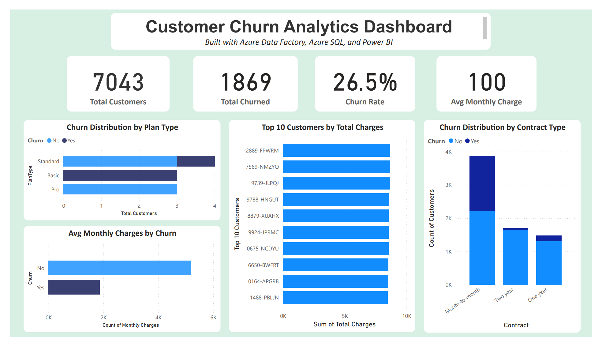

# 🧮 Customer Churn Analytics Dashboard  
📌 Built using **Azure Data Factory, Azure SQL, and Power BI** — May 2025

---

### 📝 Overview

This project delivers an end-to-end ETL pipeline that ingests, transforms, and analyzes customer churn data using **Azure Data Factory**, **Azure SQL Database**, and **Power BI**.

It simulates real-world data challenges with messy, multi-source formats (CSV, Excel, JSON), cleans and flattens the data in ADF, loads it into Azure SQL, and visualizes customer behavior and churn trends in Power BI.

---

### 🧰 Tools & Technologies Used

- **Azure Data Factory** — ETL pipeline orchestration & data flow transformations  
- **Azure SQL Database** — Data sink & analytics layer  
- **Azure Blob Storage** — Source file storage  
- **Power BI** — KPIs and customer churn visualizations  
- **T-SQL** — Validation queries  
- **Source Formats** — CSV, Excel, JSON (x2)

---

### 🔁 ETL Process Flow

#### 1. Data Ingestion
- Uploaded 4 source files (CSV, Excel, and 2 JSON) to Azure Blob Storage  
- Connected files to ADF as datasets

#### 2. Data Flow Transformations in ADF
- Flattened nested arrays from `ServiceLogs` and `ChurnLabels` JSONs  
- Used derived columns to trim and lowercase IDs  
- Standardized to create `CustomerID_JoinKey` across sources  
- Inner and left joins across the following order:

#### 3. Sink to Azure SQL
- Output written to SQL table: `CustomerChurnFinal`

#### 4. Power BI
- Connected to Azure SQL  
- Built dashboard with KPIs and visuals:
- Total Customers
- Total Churned
- Churn Rate
- Avg Monthly Charges
- Churn by Plan and Contract
- Top 10 customers by total charges

---

### 📸 Screenshots

- `screenshots/pipeline_success.png`
- `screenshots/dataflow_layout.png`
- `screenshots/sink_data_preview.png`

---

### 📊 Power BI Dashboard

---

### 🚀 Future Improvements
Add calculated churn scores

Deploy dashboard to Power BI Service for scheduled refresh

Parameterize the pipeline for different datasets

## 📬 Contact
Prakash Pyakurel
SQL & Azure Data Developer
📍 Mechanicsburg, PA
📧 LinkedIn | GitHub

